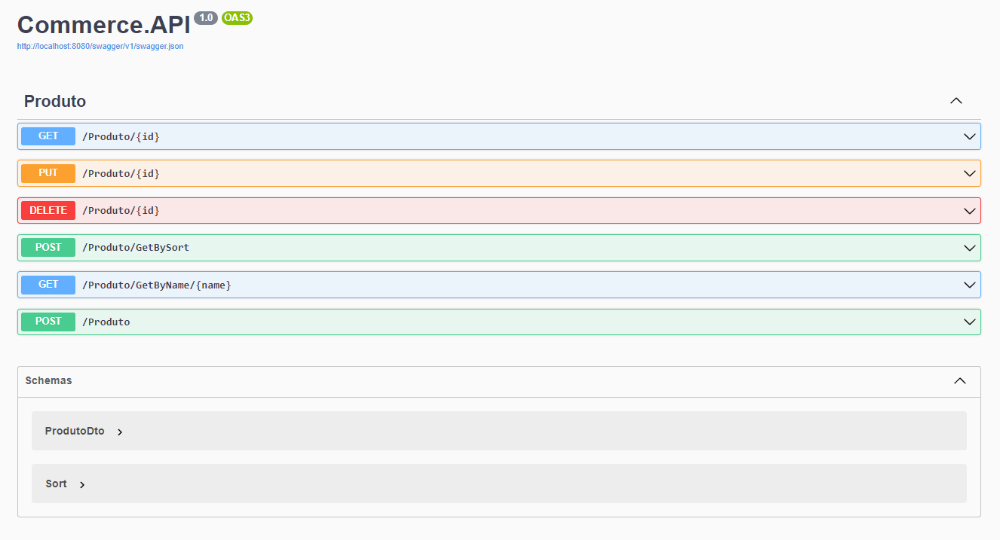

# CommerceAPI

## Sobre o **CommerceAPI**

O CommerceAPI é uma API desenvolvida seguindo as práticas do SOLID e Design Patterns, utilizando .NET 8.0 e Entity Framework. Além disso, inclui testes unitários usando XUnit. Por ser baseado no Entity Framework com migrações, o projeto segue o padrão Code First e é compatível com Docker.

## Estrutura de Camadas

- **Commerce.API:** Esta camada é responsável por receber requisições, encaminhá-las para a camada de Application e retornar as respostas das requisições.

- **Commerce.Application:** Aqui são tratados os dados e aplicadas as regras de negócio.

- **Commerce.Infrastructure:** Responsável por criar, ler, atualizar e deletar os dados do banco de dados.

- **Commerce.Domain:** Nesta camada são guardadas as Entidades e Dtos do projeto.

- **Commerce.Application.Tests:** Esta camada é dedicada aos testes da camada Commerce.Application.

- **Commerce.API.Tests:** Esta camada é responsável por testar a camada Commerce.API.

- **Commerce.Mock:** Aqui ficam armazenados os mocks de teste das camadas Commerce.Application e Commerce.API.

## Pré-Requisitos para Execução

Certifique-se de ter as seguintes ferramentas instaladas:

- Docker
- SDK .NET 8.0 (caso deseje depurar o código)

## Como Executar

### Passo 1

Clone o projeto através do link: `https://github.com/Matheus-Sleutjes/CommerceAPI.git`

### Passo 2

Navegue até o diretório do projeto e execute o seguinte comando: `docker compose up --build -d`

### Passo 3

Acesse a documentação da API através da URL: `http://localhost:8080/swagger/index.html`

## Swagger
